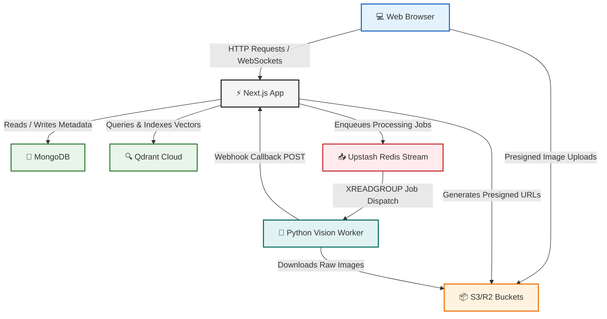

# 🐾 UnLostPaws

[](https://www.gnu.org/licenses/agpl-3.0)
[](https://nextjs.org/)
[](https://github.com/the-dot-squad/unlostpaws-worker)
[](https://www.mongodb.com/)
[](https://redis.io/)
[](https://qdrant.tech/)

**UnLostPaws** is an open-source, modern, and privacy-conscious lost-and-found pet platform. It combines precise geographic search, text normalization, and advanced AI-driven photo matching to reunite lost pets with their owners as quickly as possible.

---

## 📖 Table of Contents

- [Core Features](#-core-features)
- [System Architecture](#-system-architecture)
- [How It Works: The Ingestion Pipeline](#-how-it-works-the-ingestion-pipeline)
  - [1. Content Safety & Quality Checks](#1-content-safety--quality-checks)
  - [2. Abuse & Duplicate Prevention](#2-abuse--duplicate-prevention)
  - [3. Vector Persistence & Cross-Type Matching](#3-vector-persistence--cross-type-matching)
  - [4. Automated Telegram Channel Alerts](#4-automated-telegram-channel-alerts)
- [Key Technical & Operational Implementations](#-key-technical--operational-implementations)
  - [1. Fuzzy Text Normalization & Search Matching](#1-fuzzy-text-normalization-&-search-matching)
  - [2. Automated Cron & Housekeeping Services](#2-automated-cron-&-housekeeping-services)
  - [3. Asynchronous Multi-Stage Image Intelligence Pipeline](#3-asynchronous-multi-stage-image-intelligence-pipeline)
  - [4. Dynamic Social Profiles & Share Intents](#4-dynamic-social-profiles-&-share-intents)
  - [5. Multi-Provider Modular Mailer](#5-multi-provider-modular-mailer)
  - [6. Security, Session Revocation, and Quotas](#6-security-session-revocation-and-quotas)
- [Tech Stack](#-tech-stack)
- [Qdrant Collection Configuration](#-qdrant-collection-configuration)
- [Webhook & Internal API Authentication](#-webhook-&-internal-api-authentication)
- [Email Provider Configuration](#-email-provider-configuration)
- [Telegram Bot Integration](#-telegram-bot-integration)
- [Quick Start Guide](#-quick-start-guide)
  - [Prerequisites](#prerequisites)
  - [1. Frontend App Setup](#1-frontend-app-setup)
  - [2. Vision Worker Setup](#2-vision-worker-setup)
- [Admin Dashboard & Moderation](#-admin-dashboard-&-moderation)
- [Development Utilities](#-development-utilities)
- [Contributing](#-contributing)
- [License](#-license)

---

## ✨ Core Features

*   **AI-Driven Vision Matching:** Utilizes **SigLIP2** embeddings for visual similarity matching and image indexing via Qdrant Cloud.
*   **Geospatial Searches:** MongoDB geo-indexing coordinates the proximity searches to alert owners when a matching pet is found nearby.
*   **Automated Content Safety:** Image inspection checks for NSFW content (using **Falconsai**) and ensures images contain pets with minimum resolution/quality requirements.
*   **Telegram Channel Alerts:** Auto-post approved pet alerts (missing/surrender listings) directly to a Telegram channel with photo arrays, localized text, and geo-navigation coordinates.
*   **Dynamic Social Settings:** Administrator-manageable platform social media configurations rendering dynamically in layout components (footers, menus).
*   **Granular User Quotas & Account Rules:** Strict nested quota tracking for uploads and listings, paired with automated session revocation and staff guards on account ban.
*   **Persian & Arabic Text Normalization:** Multi-dialect character normalization ensures high fuzzy matching accuracy across language variations (breed, color).
*   **Storage Optimization:** Automatic cron cleanup purges uploaded images that are not associated with any listings or active profiles.
*   **Advanced Admin Management:** Custom settings dashboard to tune thresholds, review moderation queues, and oversee reports.

---

## 🏗️ System Architecture & Workflow

The platform uses an event-driven, decoupled architecture to separate user-facing web interactions from heavy machine learning pipeline processing.

### System Components & Interactions



### Detailed Execution & Ingestion Flow

1.  **Listing Creation:** A user creates a listing (e.g. Lost Pet) in the **Web Browser**. Next.js registers it in **MongoDB** with `processingStatus: "processing"`.
2.  **Presigned Upload:** Next.js generates presigned upload parameters; the browser uploads the image directly to **S3/R2 Buckets**.
3.  **Queue Enqueuing:** Next.js enqueues a job payload containing the image URLs, listing ID, and a secure webhook callback URL into the **Upstash Redis REST Stream**.
4.  **Worker Pull:** The **Python Vision Worker** consumes the job from the Redis Stream via `XREADGROUP`.
5.  **ML Pipeline Execution:** The worker downloads the images from S3/R2 and processes them:
    *   *Laplacian Blur:* Computes image sharpness/resolution.
    *   *NSFW Filter:* Screens for adult content using `Falconsai/nsfw_image_detection`.
    *   *Fingerprinting:* Computes cryptographic MD5 hashes and perceptual hashes (pHash).
    *   *Vector Embedding:* Extracts a 768-dimensional visual similarity vector using `SigLIP2`.
    *   *Zero-Shot Relevance:* Classifies the pet type to verify the image contains an actual animal.
6.  **Webhook Callback:** The worker posts the results payload back to Next.js via `POST /api/webhooks/vision`.
7.  **Auto-Moderation & Storage:** Next.js evaluates the safety flags. If approved, it saves the image metadata (MD5, pHash) in **MongoDB** and indexes/upserts the vector embedding into the `listingImages` collection in **Qdrant Cloud**.
8.  **Geo-Candidate Matching (MongoDB):** Next.js queries MongoDB to find active cross-type listings (e.g., matching a Lost listing against Found/Spotted listings) within a configured geographical radius.
9.  **Visual ANN Search (Qdrant Cloud):** Next.js performs an Approximate Nearest Neighbor (ANN) vector search in Qdrant Cloud using the listing's SigLIP2 embeddings, **filtered strictly to the candidate MongoDB listing IDs** found in Step 8.
10. **Hybrid Scoring & Persistence:** Next.js fuses Qdrant's visual similarity score ($75\%$ weight) with a text metadata fuzzy similarity score ($25\%$ weight, based on breed/color). Matches passing the confidence threshold are saved as `ListingMatch` documents in MongoDB and notified to users.
11. **Telegram Channel Broadcast:** If eligible (active, missing or surrender listings with images), the listing is formatted and broadcast to the Telegram channel using the Bot API.

The system comprises two primary components:
1.  **Frontend Web App (Next.js 16):** Handles client interactions, geo queries, authentication, state management, and the admin system.
2.  **Vision Worker (Python FastAPI):** Subscribes to Redis Stream jobs, performs inference (SigLIP2 embeddings, NSFW detection, perceptual hash generation), and posts results back to Next.js via a secure webhook.

---

## 🔄 How It Works: The Ingestion Pipeline

When a listing is created or updated, the images are pushed as a processing job to a Redis Stream (`IMAGE_QUEUE_STREAM`). The **Vision Worker** consumes the job, analyzes the image, and sends the payload to `/api/webhooks/vision`. 

The web application then runs the ingestion pipeline in four sequential phases:

### 1. Content Safety & Quality Checks
Before any listing goes live, the webhook runs an automated safety evaluation against administrative thresholds:
*   **NSFW Content:** If an image's NSFW score exceeds the **block threshold** (default `85%`), the listing is immediately soft-removed (`status: "removed"`) and a system moderation report is filed. If it exceeds the **review threshold** (default `50%`), the listing is placed `under_review` for admin approval.
*   **Pet Relevance:** Ensure the image contains an actual pet. If `petLikelihood` is below the configured threshold (default `35%`), the listing is sent to the review queue.
*   **Resolution & Quality:** Validates minimum width/height and checks for excessive blur. Low-quality images trigger a moderation flag.

### 2. Abuse & Duplicate Prevention
To prevent spam, abuse, or identical listing flooding:
*   **Hash Deduplication:** Uses MD5 checksums and Perceptual Hashes (pHash) to catch identical or minimally resized image uploads.
*   **Embedding Similarity:** Measures vector cosine similarity against active listings to flag potential duplicates. Listings with high similarity scores are held or flagged.

### 3. Vector Persistence & Cross-Type Matching
If the listing passes safety and spam gates:
*   Images are permanently stored, and their vectors are indexed into **Qdrant Cloud**.
*   **Cross-Type Match Generation:** The system searches Qdrant for active matching listings of the opposite type (e.g., matching a "Lost" listing against "Found" listings).
*   **Hybrid Scoring:** The matching engine generates a score (0.0 to 1.0) using:
    *   **Visual Similarity (60% weight):** Distance metrics between SigLIP2 embeddings.
    *   **Metadata Fuzzy Match (40% weight):** A Jaccard similarity index calculated over tokenized breed and color fields.
*   If a match is found above the system confidence threshold, a notification is queued.

### 4. Automated Telegram Channel Alerts
If the listing is approved and successfully active:
*   **Eligibility Filters:** Alerts are posted to the channel for active listings of type `missing` or `surrender` containing one or more images.
*   **Idempotence Engine:** Utilizes atomic MongoDB updates (`telegramPostedAt` timestamp check) to ensure each listing is posted exactly once, even in concurrent runs or reprocessing.
*   **Custom Localized Captions:** Translates and structures markdown descriptions, embedding details like pet type, breed, location (with a Google Maps link), and localized contact links in English or Persian depending on user preference.

---

## 🛠️ Key Technical & Operational Implementations

### 1. Fuzzy Text Normalization & Search Matching
To bridge dialect variations and character representation differences, the search and matching engine processes listing fields (like breed, color, and description) via a multi-layered text normalization pipeline:
*   **Persian & Arabic Unicode Normalization (`normalizePersianArabic`):**
    1.  Removes Arabic diacritics (Tashkeel like Fatha, Damma, Tanween).
    2.  Maps all Alef variations (أ, إ, آ, ٱ) to a standard Alef (ا).
    3.  Maps Arabic Yeh (ي) and Alef Maksura (ى) to Persian Yeh (ی).
    4.  Maps Arabic Kaf (ك) to Persian Kaf (ک).
    5.  Normalizes Teh Marbuta (ة) to Heh (ه).
    6.  Replaces Zero Width Non-Joiners (ZWNJ) with spaces to split compound words cleanly.
*   **Variant-Insensitive Regex Queries:** Dynamically generates regex queries (`makeVariantInsensitiveRegex`) for text searches, ensuring listings are matched regardless of keyboard differences or specific spelling variations.
*   **Fuzzy Token & String Distance (`levenshteinDistance`):** Computes fuzzy Jaccard similarity metrics over tokenized lists, incorporating a length-sensitive Levenshtein threshold (exact match for tokens < 4 chars, max 1 edit for 4-7 chars, and max 2 edits for 8+ chars).

### 2. Automated Cron & Housekeeping Services
The platform features automated cron endpoints to maintain data integrity, clean up orphan media, and handle lifecycle updates:
*   **Orphan Media Purge (`/api/cron/cleanup-uploads`):** Scans the database models (`Listings`, `ListingImages`, `OwnedPets`, and `user` profile pictures) to gather all active file keys, then compares them with physical files in local storage/S3. Any unreferenced file older than 24 hours is permanently deleted to prevent storage bloat.
*   **Listing Expiry Handler (`/api/cron/expire-listings`):** Automatically transitions aged active listings to an expired state based on platform-configured lifecycle windows.
*   **Failed Job Reconciliation (`/api/cron/match-missing-listings`):** Identifies active listings that failed to complete processing in the primary pipeline, re-enqueuing them to guarantee matching coverage and data sync.

### 3. Asynchronous Multi-Stage Image Intelligence Pipeline
The system splits heavy computation into localized FastAPI worker tasks, running the following processing chain:
*   **NSFW Content Safety Verification:** Screens images via `Falconsai/nsfw_image_detection` to auto-flag or soft-remove inappropriate listings.
*   **Relevance & Pet Verification:** Checks zero-shot SigLIP2 classification scores to verify the uploaded image actually contains a pet corresponding to the listing details.
*   **Cryptographic & Perceptual Fingerprinting:** Generates MD5 signatures and pHashes to quickly flag duplicate uploads, preventing spam and system abuse.

### 4. Dynamic Social Profiles & Share Intents
Instead of hardcoding URLs, the platform features admin-manageable social link registers:
*   **Custom Social Intents:** A unified social sharing intent builder (`src/lib/share/social-intents.js`) handles native popup dimensions and clean parameter escaping for Facebook, Telegram, WhatsApp, and X (formerly Twitter).
*   **Configurable Footer Profiles:** Supports dynamic additions, sanitization, and rendering of platform-wide social handles stored as part of the system configuration.

### 5. Multi-Provider Modular Mailer
The communication layer is refactored into a provider-agnostic modular system:
*   **Supported Adapters:** Integrated support for **Mailtrap**, **Mailjet**, and **ZeptoMail**.
*   **Dynamic API Origins:** Allows custom API origin overrides (e.g., `MAILTRAP_API_ORIGIN`, `MAILJET_API_ORIGIN`, `ZEPTOMAIL_API_ORIGIN`) for compliance, proxying, or sandboxed dev networks.
*   **Modular Templates:** Categorized into transactional files (`account`, `contact`, `matches`, `moderation`, `reports`) for easy customization and translations.

### 6. Security, Session Revocation, and Quotas
Security is built directly into the account lifecycle:
*   **Immediate Revocation:** Banned user status is checked dynamically during request authentication, instantly revoking active sessions and rejecting form/upload operations.
*   **Rate Limits and Quotas:** Nested quota tracking inside the MongoDB User schema limits daily/monthly listings and reports, protecting database and compute costs.

---

## 💻 Tech Stack

*   **Frontend framework:** Next.js 16 (App Router, Internationalization with `next-intl`)
*   **Styling:** CSS Variables + TailwindCSS
*   **Database:** MongoDB via Mongoose (Geospatial indexing & core document models)
*   **Vector Search:** Qdrant Cloud (Embedding indices and similarity lookups)
*   **State / Queues:** Upstash Redis (Stateless HTTP REST Client for streams, rate limiting, and jobs)
*   **Auth:** `better-auth` integration
*   **Email Delivery:** Mailtrap, Mailjet, or ZeptoMail (modular client adapters)
*   **Storage:** S3/Cloudflare R2 (production) & local directory storage (development)
*   **Machine Learning Worker:** Python FastAPI, SigLIP2, Falconsai NSFW, pHash

---

## 🔍 Qdrant Collection Configuration

The platform uses **Qdrant Cloud** for vector similarity search across two collections. Collections and payload indexes are auto-created on first access via `ensureCollections()`, but the schema below is essential for manual recovery if collections are deleted.

### Collections

| Collection | Purpose | Vector Size | Distance |
| :--- | :--- | :---: | :---: |
| `listing_images` | Listing image SigLIP2 embeddings for cross-type matching | Configured via `QDRANT_VECTOR_SIZE` (default: `768`) | Cosine |
| `owned_pets` | Registered pet embeddings for owner-matching | Same as above | Cosine |

### Quantization (Optional)

When `QDRANT_SCALAR_QUANTIZATION=true` is set, collections are created with **int8 scalar quantization**:

```json
{
  "quantization_config": {
    "scalar": {
      "type": "int8",
      "quantile": 0.99,
      "always_ram": true
    }
  }
}
```

### Payload Indexes

**`listing_images`** indexes (all `keyword` type):
- `listingId`, `listingStatus`, `petType`, `listingType`, `embeddingModel`, `userId`

**`owned_pets`** indexes (all `keyword` type):
- `userId`, `status`, `petType`, `embeddingModel`

### Environment Variables

| Variable | Required | Default | Description |
| :--- | :---: | :--- | :--- |
| `QDRANT_URL` | Yes | — | Qdrant Cloud cluster URL |
| `QDRANT_API_KEY` | Yes | — | Qdrant API key |
| `QDRANT_VECTOR_SIZE` | No | `768` | Embedding vector dimensions (must match ML model output) |
| `QDRANT_SCALAR_QUANTIZATION` | No | `false` | Enable int8 scalar quantization for reduced memory |

---

## 🔐 Webhook & Internal API Authentication

The ML vision worker and cron jobs authenticate via shared secrets. The platform supports three authentication methods for internal endpoints:

### Authentication Methods

| Method | Header / Parameter | Example |
| :--- | :--- | :--- |
| **Bearer Token** (preferred) | `Authorization: Bearer <secret>` | `Authorization: Bearer my-webhook-secret` |
| **API Key Header** | `x-api-key: <secret>` | `x-api-key: my-webhook-secret` |
| **Query Parameter** | `?token=<secret>` | `?token=my-webhook-secret` |

> **⚠️ Note:** The `Authorization: Bearer` or `x-api-key` header methods are strongly preferred over query parameters. Query strings may be logged by reverse proxies, CDNs, and server access logs, potentially exposing the secret.

### Endpoint Authentication Map

| Endpoint | Secret Variable | Auth Function | Methods |
| :--- | :--- | :--- | :--- |
| `POST /api/webhooks/vision` | `WEBHOOK_SECRET` | `rejectInvalidInternalSecret` | Bearer, x-api-key, ?token |
| `GET /api/cron/*` | `CRON_SECRET` | `rejectInvalidBearer` | Bearer only |

### Worker Configuration

Ensure the `WEBHOOK_SECRET` environment variable matches between the Next.js app (`.env.local`) and the vision worker (`.env`). The worker posts results to the webhook callback URL included in each Redis stream job payload.

---

## 📧 Email Provider Configuration

The platform supports multiple email providers using a modular adapter interface. Configure the `EMAIL_PROVIDER` environment variable along with the credentials corresponding to your chosen provider:

- **`mailtrap`** (Default for development)
  - `MAILTRAP_TOKEN`: API token
  - `MAILTRAP_SANDBOX_ID`: Sandbox ID (for testing)
  - `MAILTRAP_API_ORIGIN` (Optional override, defaults to `https://sandbox.api.mailtrap.io`)
- **`mailjet`**
  - `MAILJET_API_KEY`: API public key
  - `MAILJET_API_SECRET`: API private key
  - `MAILJET_API_ORIGIN` (Optional override, defaults to `https://api.mailjet.com/v3.1/send`)
- **`zeptomail`**
  - `ZEPTOMAIL_TOKEN`: Authorization Token
  - `ZEPTOMAIL_API_ORIGIN` (Optional override, defaults to `https://api.zeptomail.com/v1.1/email`)

*Note: In development mode, if the chosen provider's environment variables are missing, the platform automatically logs the outbound email content to the server terminal console (`console fallback`).*

---

## 📢 Telegram Bot Integration

UnLostPaws can automatically post active pet alerts (listings of type `missing` or `surrender` containing at least one image) to a designated Telegram channel.

### Configuration
Configure the following variables in your `.env.local` file:
- `TELEGRAM_BOT_TOKEN`: The API token of your Telegram bot (created via @BotFather).
- `TELEGRAM_CHANNEL_ID`: Username of your public channel (e.g., `@mychannel`) or the chat ID of your private channel (typically starting with `-100`).

*Note: Both variables are required to enable posting. The bot must be added to the channel as an Administrator with permission to post messages.*


## 🚀 Quick Start Guide

### Prerequisites
*   Node.js (v18.x or above)
*   MongoDB Instance
*   Upstash Redis Account (REST API)
*   Qdrant Cloud Account

### 1. Frontend App Setup

```bash
# Clone the repository
git clone https://github.com/the-dot-squad/unlostpaws.git
cd unlostpaws

# Install dependencies
npm install

# Setup environment variables
cp .env.example .env.local
```

Edit your `.env.local` file with your connection strings (MongoDB, Upstash Redis, Qdrant, and storage credentials).

```bash
# Run the development server (Webpack)
npm run dev

# Or run with Turbopack
npm run dev:turbo
```

The web client will now be accessible at `http://localhost:3000`.

### 2. Vision Worker Setup

The [vision worker](https://github.com/the-dot-squad/unlostpaws-worker) acts as an independent background service that processes images asynchronously from Redis. You can set it up using one of the following methods.

*(Note: Ensure that the `WEBHOOK_SECRET` environment variable matches in both your Next.js `.env.local` and your worker's `.env` to authenticate webhook callbacks).*

#### Option A: Run Pre-built Image from GHCR (Recommended)
Since the worker is published on the GitHub Container Registry, you can run it directly without cloning the code or compiling dependencies:

1. Create a local `.env` configuration file containing the necessary environment variables (e.g., `REDIS_URL`, `WEBHOOK_SECRET`, and optional `VISION_PROFILE`).
2. Start the container (mounting a persistent volume for the Hugging Face model cache to prevent re-downloads):
   ```bash
   docker run -d \
     --name unlostpaws-worker \
     --env-file .env \
     -v unlostpaws-hf-cache:/app/.cache/huggingface \
     ghcr.io/the-dot-squad/unlostpaws-worker:latest
   ```

#### Option B: Run Locally on Bare Metal (No Docker)
To run and inspect the Python service directly on your system (Python 3.12+ required, [uv](https://github.com/astral-sh/uv) recommended):

1. Clone the worker repository:
   ```bash
   git clone https://github.com/the-dot-squad/unlostpaws-worker.git
   cd unlostpaws-worker
   ```
2. Configure environment variables:
   ```bash
   cp .env.example .env
   # Edit .env to set your REDIS_URL and WEBHOOK_SECRET
   ```
3. Install dependencies and run the service:
   ```bash
   pip install -r requirements.txt
   export PYTHONPATH=.
   python app/main.py
   ```

#### Option C: Run Locally with Docker Compose
If you want to run the worker in Docker compiled from source:

1. Clone the worker repository and copy the environment template:
   ```bash
   git clone https://github.com/the-dot-squad/unlostpaws-worker.git
   cd unlostpaws-worker
   cp .env.example .env
   # Edit .env, setting REDIS_URL to point to your Redis instance
   # (e.g. redis://host.docker.internal:6379 for host-network Redis)
   ```
2. Launch with Docker Compose:
   ```bash
   docker compose up --build
   ```

---

## 🎛️ Admin Dashboard & Moderation

An administrative dashboard is located at `/admin` to monitor and manage the system. To designate an admin user:

1.  Register an account on the platform.
2.  Open your MongoDB shell or manager and update the user document role:
    ```js
    db.user.updateOne({ email: "user@example.com" }, { $set: { role: "admin" } })
    ```
3.  Navigate to `/admin` to:
    *   Review safety, duplicate, and quality violation reports in the **Reports Queue**.
    *   Approve or block listings under review.
    *   Toggle global settings (Enable/Disable safety assessments, tune thresholds, adjust matching constraints).

---

## 🛠️ Development Utilities

Useful npm scripts provided in the project:

```bash
# Erase all ML fingerprints, matched results, and Qdrant points (safe environment reset)
npm run ml:reset

# Wipe intelligence metadata databases
npm run ml:reset-intelligence

# Re-enqueue all active listings into the Redis Stream for reprocessing
npm run ml:reprocess
```

---

## 🤝 Contributing

Contributions are what make the open-source community such an amazing place to learn, inspire, and create. Any contributions you make are **greatly appreciated**.

1.  Fork the Project
2.  Create your Feature Branch (`git checkout -b feature/AmazingFeature`)
3.  Commit your Changes (`git commit -m 'Add some AmazingFeature'`)
4.  Push to the Branch (`git push origin feature/AmazingFeature`)
5.  Open a Pull Request

Please ensure your code complies with the project's ESLint rules and includes relevant tests for any critical business logic.

---

## 📄 License

This project is licensed under the **GNU Affero General Public License v3.0 (AGPL-3.0)**. 

See the [LICENSE](./LICENSE) file in the repository or read the license details [here](https://www.gnu.org/licenses/agpl-3.0.html) for more information. Briefly, this copyleft license guarantees your freedom to share and change all versions of the program, and specifically requires that the source code of any modified versions run on network servers must be made available to users interacting with them over the network.
